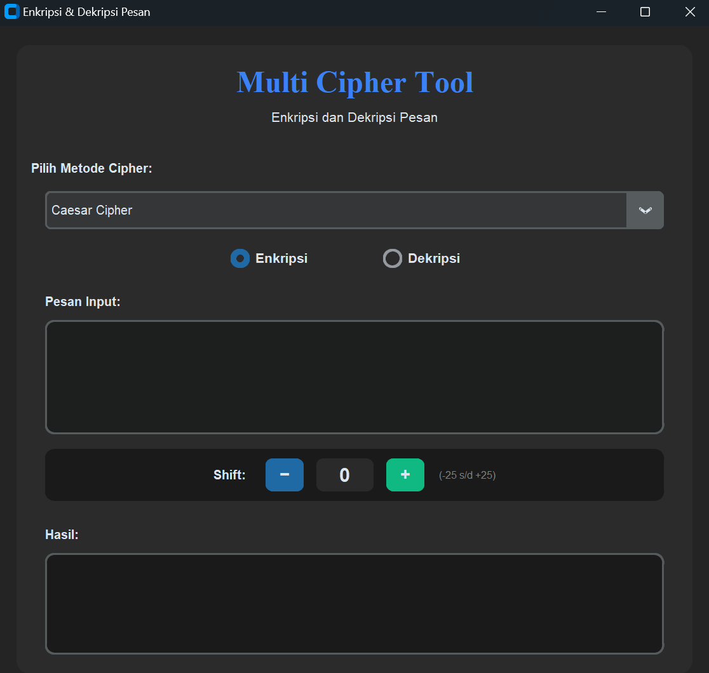

# 🔐 Cipher Encrypt-Decrypt Tool

> **Aplikasi Enkripsi & Dekripsi dengan GUI customtkinter.**

---

## 📋 Tentang Proyek

Aplikasi ini adalah aplikasi desktop berbasis GUI yang dibuat sebagai **Tugas Akhir Mata Kuliah Pemrograman Dasar**. Aplikasi ini memungkinkan pengguna untuk mengamankan pesan teks menggunakan berbagai algoritma kriptografi klasik dengan antarmuka yang modern dan mudah digunakan (*User Friendly*).

Dibuat menggunakan Python dan library `customtkinter`, proyek ini mendemonstrasikan penerapan logika algoritma manipulasi string dalam balutan desain antarmuka modern.


## 🛠️ Teknologi

* **Bahasa:** Python 
* **Library UI:** [CustomTkinter](https://github.com/TomSchimansky/CustomTkinter)
* **Tools:** VS Code 

## 📸 Screenshots

Berikut adalah tampilan aplikasi saat dijalankan:




## 🚀 Cara Menjalankan (Installation)

Karena aplikasi ini menggunakan library eksternal untuk tampilan GUI-nya, kamu perlu menginstalnya terlebih dahulu.

### 1. Clone Repositori
```bash
git clone [https://github.com/rakyanbhuminagari-beep/TA_PROGDAS_Rakyan-Bhumi-Nagari_Aplikasi-Encrypt-Decrypt-Cipher.git](https://github.com/rakyanbhuminagari-beep/TA_PROGDAS_Rakyan-Bhumi-Nagari_Aplikasi-Encrypt-Decrypt-Cipher.git)
````

### 2\. Masuk ke Direktori

```bash
cd TA_PROGDAS_Rakyan-Bhumi-Nagari_Aplikasi-Encrypt-Decrypt-Cipher
```

### 3\. Install Library (PENTING\!)

Aplikasi ini membutuhkan **CustomTkinter**. Install dengan perintah berikut di terminal/CMD:

```bash
pip install customtkinter
```

### 4\. Jalankan Aplikasi

```bash
python main.py
```

*(Ganti `main.py` dengan nama file python utama kamu jika berbeda)*

## 🧠 Penjelasan Singkat Algoritma

  * **Caesar Cipher:** Teknik substitusi sederhana di mana setiap huruf digeser sejumlah *n* posisi dalam alfabet.
  * **Vigenere Cipher:** Pengembangan dari Caesar Cipher yang menggunakan kata kunci untuk menentukan besaran geseran yang berbeda-beda untuk setiap huruf.
  * **ROT Series:** Varian spesifik dari Caesar Cipher (ROT13 geser 13, ROT47 mencakup simbol ASCII).

## 👤 Author

**Rakyan Bhumi Nagari**

  * Mahasiswa Teknik Komputer Universitas Diponegoro
  * GitHub: [@rakyanbhuminagari-beep](https://www.google.com/search?q=https://github.com/rakyanbhuminagari-beep)

-----

*Dibuat untuk Tugas Akhir Pemrograman Dasar.*

----
